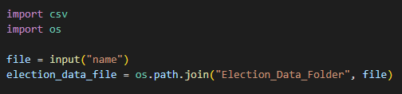

# Election-Analysis

## Overview
We were tasked with assisting a Board of Elections employee, Tom, with auditing the tabulated results for a U.S. congressional election in Colorado. We were tasked with finding each candidate's votes, each county's votes, their vote percentages, and the winner of the election. 

## Results
We were able to analyze the election data and answer all of the questions that Tom had for us. 

**County Votes:**
<ul>
  <li>Jefferson received 38,855 votes and 10.5% of the total vote count.</li>
  <li>Denver received 306,055 votes and 82.8% of the total vote count.</li>
  <li>Arapahoe received 24,801 votes and 6.7% of the total vote count.</li>
</ul>

**Candidate Votes:**
<ul>
  <li>Charles Casper Stockham receiveed 85,213 votes and 23.0% of the total vote count.</li>
  <li>Diana DeGette received 272,892 votes and 73.8% of the total vote count.</li>
  <li>Raymon Anthony Doane received 11,606 votes and 3.1% of the total vote count.</li>
</ul>

**Summarizing Data:**
<ul>
  <li>Denver had the highest turnout of any county.</li>
  <li>Diana DeGette won the majority vote.</li>
  <li>There were 369,711 total votes.</li>
</ul>

The text file containing the results data can be found <a href="analysis/election_analysis.txt">here</a>.

## Summary
The manager had great insight in proposing that we perform our election analysis in Python versus Excel. Python allows us to automate our process moreso than Excel. Our code for this analysis could be reused for other elections, given the data is proposed in a csv file. All we would have to do is import a new file into our code. A way to make this user friendly may be to add in an input function. Perhaps if all election data is stored in the same "Resources" folder, we could prompt a user to input the name of the data file and the file_to_load would automatically pull that file. That could look like this:

This code is firstly importing the os and csv modules to be able to search through our computer's operating system and to then have the capability to read .csv files. The third line is setting a variable, file, to be equal to the input that the user puts in. The line after is then setting the election_data_file that we will be calling upon later to open to the path to the file. Assuming that all election data is put into the correct "Election_Data_Folder" folder by the Board of Elections, the user would only have needed to put in the exact name of the file. The prompt for the input could be rewritten to state: "Please input file name exactly. This is case sensitive and the .csv must be included."

This could also be done with the text file that it outputs the results to. 

An imperitave factor in making this code reusable would be that the .csv file is formatted the same way. This means that the first row would need to be the header. In addition, the columns would need to be in order as "Ballot ID", "County", and "Candidate." 

